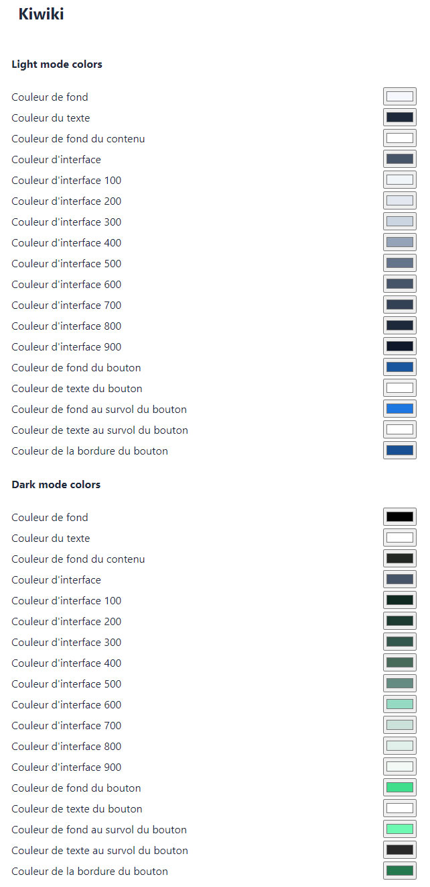

# Dokuwiki Kiwiki Theme

Flex theme with lots of css fix and some ease of use features. You can change all colors of the theme to your own taste.

https://www.dokuwiki.org/template:kiwiki

### 2023-06-19
- CSS fixes on the extension manager page
- New screenshots to show the theme light/dark mode switcher

### 2023-06-16
- Added light/dark theme mode, with separated customization
- Detection of os preferences for light or dark mode
- Override with cookie when clicking a button
  
### 2023-06-15
- Fixed word wrapping for pre code blocks on mobile
- Fixed the edit icon position on mobile

### 2023-06-14
- Initial release

## Screenshots

Basic colors

Dark colors example

Theme colors editor

