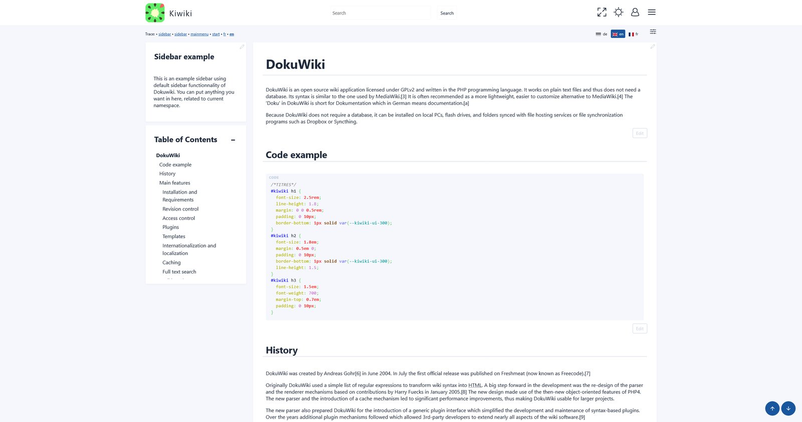
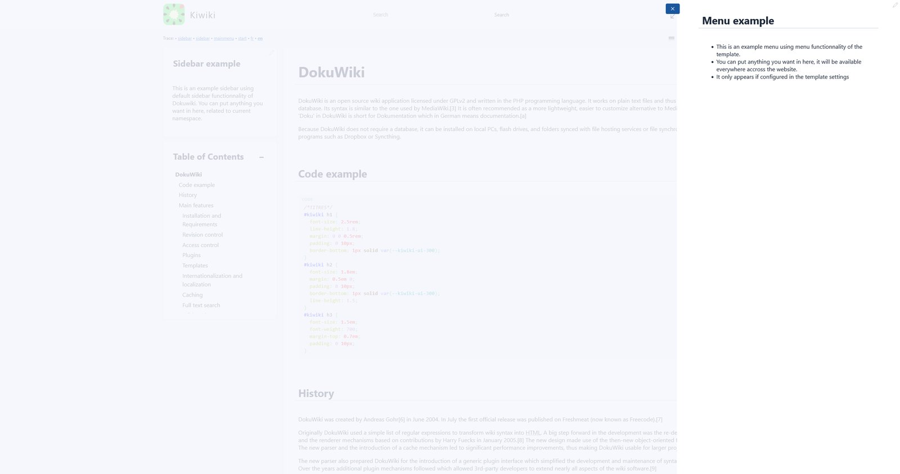
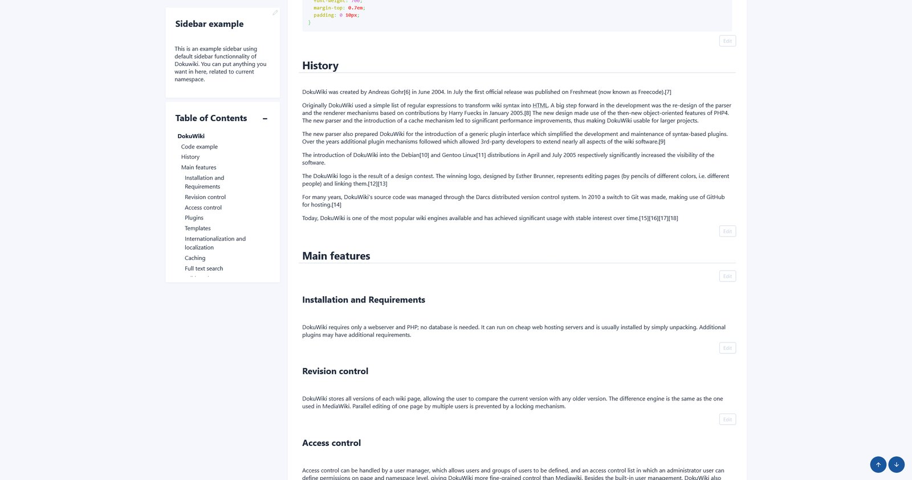
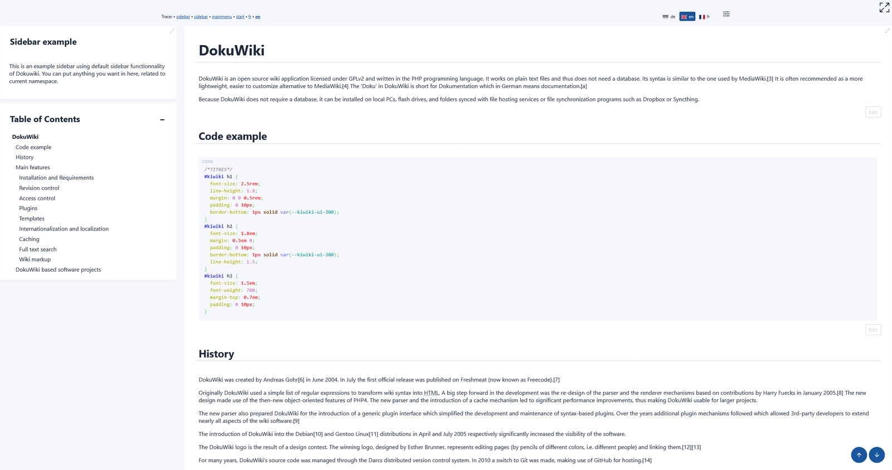
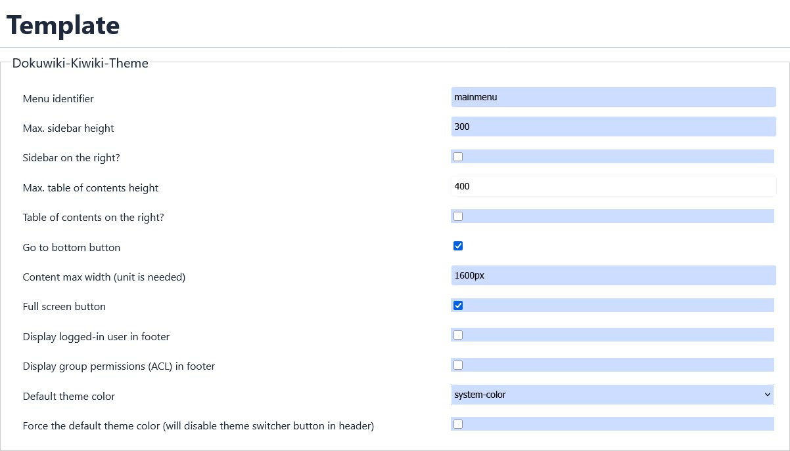
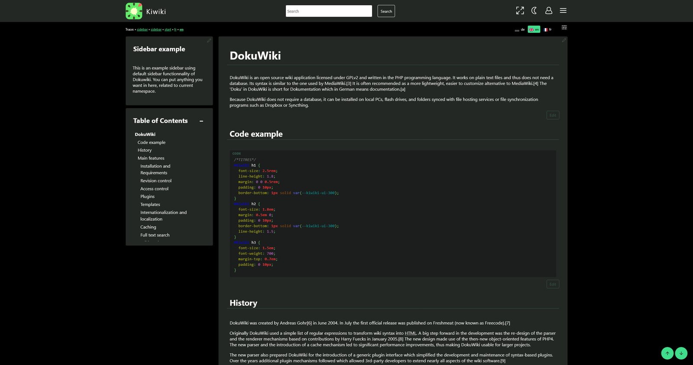
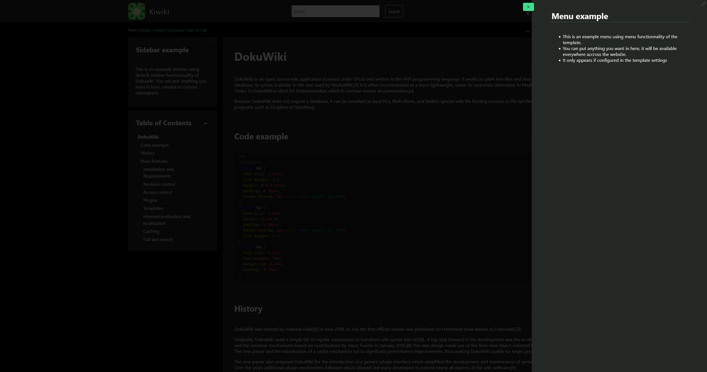

# Dokuwiki Kiwiki Theme

Flex theme with lots of css fix and some ease of use features. You can change all colors of the theme to your own taste.
Templage page on Dokuwiki : https://www.dokuwiki.org/template:kiwiki

## Screenshots
### General layout

### Main menu

### Sticky sidebar

### Full width reading

### Template settings

### Dark mode

  
Changelog

### 2025-07-08
This new version of Kiwiki is a major refactoring of the layout to get Sidebars default functionnality from Dokuwiki working (see https://github.com/nicolasprigent/Dokuwiki-Kiwiki-Theme/issues/42).

For UI reasons, I've decided to add my previous menu functionnality in a burger menu : this menu functionnality was intended at first to be accessible accross all website, so now that sidebars are available, it makes more sense to put the menu like this. It also solve this issue : https://github.com/nicolasprigent/Dokuwiki-Kiwiki-Theme/issues/26
Other fixes : 

- Added two options to get the sidebar, table of content or both on the right side of the website https://github.com/nicolasprigent/Dokuwiki-Kiwiki-Theme/issues/37
- CSS fixes and new functionnalities to get menu and new content layout working
- Better TOC sticky on mobile
- Sidebar is now on the bottom of the page on mobile
- Default content max width is now 1600px to get a better experience when using left and right sidebars together.
  
### 2025-07-07
- Fix:Cross site scripting vulnerability (https://github.com/nicolasprigent/Dokuwiki-Kiwiki-Theme/issues/43)

### 2025-04-30
- Fix:table of content not showing on some admin pages

### 2025-04-24
- Added informal german language
  
### 2025-01-24
- Fix:the edit icon on revisions https://github.com/nicolasprigent/Dokuwiki-Kiwiki-Theme/issues/36
  
### 2024-12-12
- Fix:the edit menu button for non-root domain installs
  
### 2024-11-27
- Fix:CSS fixes for discussion plugin

### 2024-10-30
- Added a functionnality to get a different logo on dark/light theme (https://github.com/nicolasprigent/Dokuwiki-Kiwiki-Theme/issues/31). Upload your custom logos on the root of your install :
  - logo.png for default logo (still mandatory for this to work)
  - logo-dark.png for dark logo
  - logo-light.png for light logo

### 2024-05-13
- Fix: php warning errors on non existing variables https://github.com/nicolasprigent/Dokuwiki-Kiwiki-Theme/issues/16
- Refactoring of the edit icon button for it to use the correct dokuwiki classes (Menu and MenuItem), and get the same authorizations than the default edit page link. https://github.com/nicolasprigent/Dokuwiki-Kiwiki-Theme/issues/23
  
### 2024-02-26
- Fix: edit_page button break when userewrite and useslash config enabled. Thanks to @AzurCrystal
- Fix : long links overflow on mobile view. Thanks to @Gabe-LSN

### 2024-01-27
- Added max height for left menu

### 2024-01-16
- Added Chinese language. Thanks to @AzurCrystal

### 2024-01-10
- Added css for tables in content
  
### 2023-11-27
- Updated editor css for readability

### 2023-11-23
- The edit button was limited to admin group only, now it checks edit permissions
  
### 2023-11-06
- Fix on mobile menu switch not hiding navigation menu on mobile if translation plugin is activated

### 2023-10-19 (features suggestions from @Chris75forumname -> https://github.com/nicolasprigent/Dokuwiki-Kiwiki-Theme/issues/12)
- Added go to bottom button with option to activate it or not
- Added fullscreen button in header
- Added connected user information on footer, with option to activate it or not
- Added ACL informations on footer (only for editors), with option to activate it or not
- Added ACL group list in user page has an info 

### 2023-10-18
- Added back the message area on connection page

### 2023-10-12
- Added max height for table of content in theme configuration

### 2023-10-02
- Bug fix on menu disappearing on deep level pages

### 2023-09-31
- Added compatibility with Translation Plugin
  
### 2023-09-01
- Updated css to have the filters working on small size screens

### 2023-07-25
- new language Added German language - Thanks to @holisticagile
  
### 2023-07-23
- Fixed issue about public wikis getting no header
- Added back to home link on login page
- Some css fixes on login page

### 2023-07-02
- New style parameter for changing header color

### 2023-06-21
- CSS fix for dark mode
- Default style.ini adjusted on some colors
  
### 2023-06-19
- CSS fixes on the extension manager page
- New screenshots to show the theme light/dark mode switcher
- Restored functionnality to change the logo (as described here : https://www.dokuwiki.org/template:dokuwiki#changing_the_logo)

### 2023-06-16
- Added light/dark theme mode, with separated customization
- Detection of os preferences for light or dark mode
- Override with cookie when clicking a button
  
### 2023-06-15
- Fixed word wrapping for pre code blocks on mobile
- Fixed the edit icon position on mobile

### 2023-06-14
- Initial release

